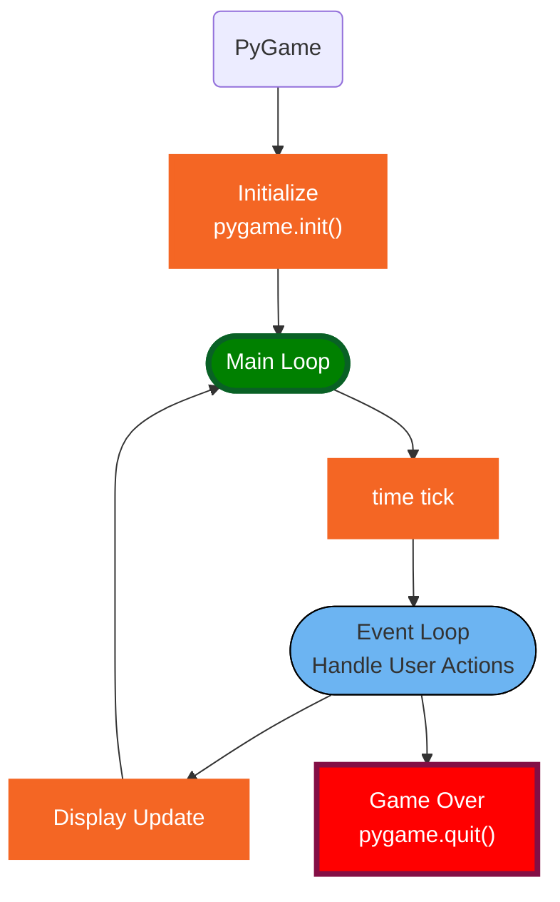
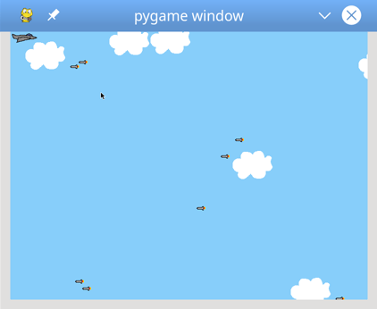
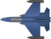
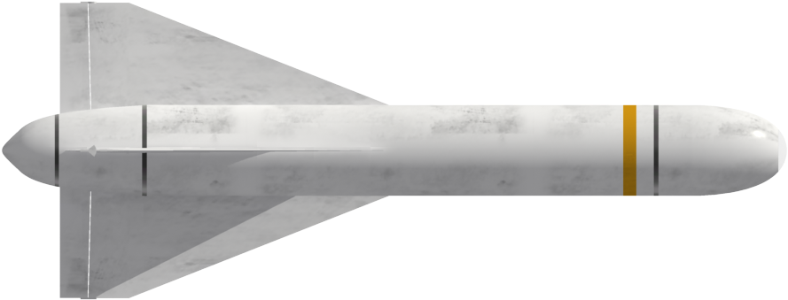

<h1>Python Game Learning Notes</h1>

Click to see website: [PyGame Document](https://www.pygame.org/docs/)

[PDF doc](https://buildmedia.readthedocs.org/media/pdf/pygame/latest/pygame.pdf)

[Download sounds](https://freesound.org/people/adh.dreaming/sounds)

[memory Game](https://www.youtube.com/watch?v=KAn1f16Cl1I)

[Jump Game ](https://www.youtube.com/watch?v=AY9MnQ4x3zk)

[Space Invaders](https://www.youtube.com/watch?v=Q-__8Xw9KTM)

[Program Arcade Games](http://programarcadegames.com/index.php?chapter=example_code)

[Physics Simulations](https://www.youtube.com/watch?v=tLsi2DeUsak)

📌 pip: Package Installer for Python
preferred installer program

❓ What is pygame?

✔️ Pygame is a multimedia library for Python for making games and multimedia applications.

❓ What is Surface?
✔️ pygame object for representing images.  

❓ what is blit()?
✔️ blit() — blit stands for Block Image Transfer — and it's going to copy the contents of one Surface onto another Surface . The two surfaces in question are the screen that you created and the new Surface. blit() will take that rectangular Surface and put it on top of the screen.

❓ what is flip()?

✔️ flip() updates the entire Surface on the display. pygame. display. update() updates the entire Surface, only if no argument is passed.

❓ what is move_ip() for?

✔️ The move_ip() stands for move in-place, which means we move the rectangle relative to its previous position.

- [create main surface.](#create-main-surface)
- [create main loop](#create-main-loop)
- [add time tick](#add-time-tick)
- [images](#images)
- [color](#color)
- [Bounced Ball](#bounced-ball)
- [Draw Text](#draw-text)
- [Draw Shapes](#draw-shapes)
- [Use class](#use-class)
- [Making sounds](#making-sounds)
- [Collision](#collision)
- [Fight Chimp](#fight-chimp)
- [Fire Bullets](#fire-bullets)
- [Button](#button)
- [animation](#animation)
- [Sample games](#sample-games)
- [Online Game](#online-game)


## create main surface.

```py
WIDTH, HEIGHT = 900, 500
window = pygame.display.set_mode((WIDTH, HEIGHT))
```
Click to see source code: [open a window](../src/openWindow.py)

## create main loop
it will keep window open

```py
def mainloop():
    run = True
    while run:
        for event in pygame.event.get():
            if event.type==pygame.QUIT:
                run = False
    
    pygame.quit()

if __name__ == '__main__':
    main()
```

## add time tick

```py
clock = pygame.time.Clock()
clock.tick(1) #FPS: 1 frame per second
```
Click to see source code: [Time tick](../src/timeTick.py)


## images
* [Load Image, resize, rotate](../src/loadImage.py)
```py
YELLO_SPACESHIP_IMAGE = pygame.image.load(os.path.join('Assets', 'spaceship_yellow.png'))
```
* [load and display image](../src/loadImage2.py)
* [loadImage(), scale and move image](../src/loadImage3.py)
* [Move Image](../src/moveImage.py)
* [Move image with muse](../src/image1.py)
* [rotate, change size of image](../src/image2.py)

❓ What is Surface?
✔️ surfaces are generally used to represent the appearance of the object and its position on the screen. All the objects, text, images that we create in Pygame are created using surfaces.

❓ What is flip()?
✔️ display.flip() will update the contents of the entire display

❓ What is update()?
✔️ display.update() allows to update a portion of the screen, instead of the entire area of the screen. Passing no arguments, updates the entire display. display.update() is faster in most cases.

❓ What is blit()?
✔️blit stands for Block Image Transfer—and it's going to copy the contents of one Surface onto another Surface .

```py
pygame.display.set((w, h), pygame.DOUBLEBUF)
```

## color
Click to see source code: [Background color](../src/color.py)

## Bounced Ball
* [Bounced Ball](../src/ball.py)

## Draw Text
* [Draw Text](../src/drawText.py)
* [Editable Text](../src/editText.py)
* [PyGame Coordinates](../src/coordinates.py)

## Draw Shapes
* [draw line](../src/drawLine.py)
* [draw arc](../src/drawArc.py)
* [draw circle](../src/drawCircle.py)
* [common function for rectangle](../src/rect.py)
  
🔑⚡️ **Knowlodge Base:**
1. get moving speed based on arrow key from dict [](../src/rect4.py)
2. 2 way to create rect: Rect(x,y,w,h) or Rect(pos, size)
3. to draw text(a. create font; b. create Surface; c. blit on screen)
```py
def draw_text(text, pos):
    font = pygame.font.SysFont('Arial Bold', 25)    
    img = font.render(text, True, BLACK)
    screen.blit(img, pos)
```
💡👉 screen.blit(img, rect) works the same way.

* [Draw Rectangle](../src/drawRectangle.py)
* [Draw Eclipses, catch mouse actions](../src/drawEllipses.py)
* [draw rectagle on screen](../src/rect1.py)
* [Special points of rectangle](../src/rect2.py)
* [change rectangle location by key](../src/rect3.py)
* [move_ip() move rectangle by arrow keys](../src/rect4.py)
* [inflate_ip() change rect size](../src/rect5.py)
* [clip(), union()](../src/rect6.py)
* [event.pos, event.rel](../src/rect7.py)
* [event bounced rectangle](../src/rect8.py)

## Use class
* [Super class](../src/appSuper.py)
* [Subclass](../src/appSub.py)
* [Text class](../src/appText.py)
* [My App Super class](../src/myapp.py)
* [Scene class, different frames](../src/scene.py)

  
## Making sounds
[wav, mp3](../src/sound1.py)

## Collision
* [collidepoint(), randompoints()](../src/rect9.py)
* [colliderect(), randomrects()](../src/rect10.py)
* [colliderect(), red collisioned](../src/rect11.py)
* [colliderect(), arrow key collision](../src/rect20.py)
* [Understand Collision, large image, small hit area](../src/rect21.py)
* [hit chimp head](../src/rect22.py)

## Fight Chimp
* [Display Chimp image](../src/displayChimp.py)
* [move chimp on screen](../src/moveChimp.py)
* [mouse Fist](../src/mouseFist.py)
* [mouse click punch sound](../src/fistPunch.py)
* [](../src/fistHitChimp.py)


## Fire Bullets
* [fire missle](../src/rect23.py)
* [Hit target]()

## Button
* [](../src/button1.py)
* [](../src/button2.py)
* [](../src/button3.py)
* [](../src/button4.py)
* [](../src/button5.py)
* [](../src/button6.py)
* [Button class extends Rect](../src/button7.py)

💡👉 Can get mouse position any time.

## animation
[Super Mario](../src/animationMario.py)
[Scene of game](../src/animationCloud.py)

## Sample games
* [Fist and Chimp](../src/chimp.py)
* [Ping-Pong](../src/pong.py)
* [Game Base](../src/app.py)





## Online Game
[pygame and socket](https://www.youtube.com/watch?v=McoDjOCb2Zo)