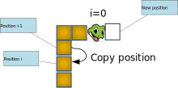

<h1>Snake Eat Apple</h1>

## start up

[open game window](../snake/src/game.py)

## display apple and snake
[display apple and snake](../snake/src/snakeApple.py)

## move snake

[move snake by key](../snake/src/snakeMove.py)

😢❌: do not allow snake goes backwards?

## collision
[Eat apple](../snake/src/collision.py)
[rasie Exception when snake hit bounds](../snake/src/outBound.py)
