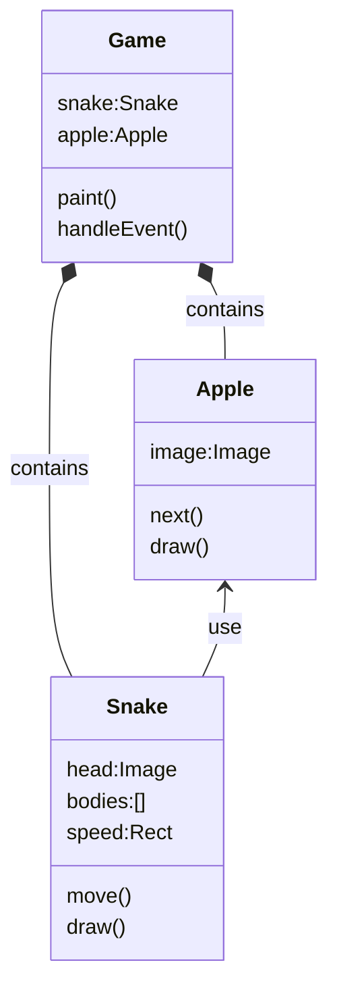

<h1>Snake Eat Apple Game</h1>

- [Getting start](#getting-start)
- [Objects in this game](#objects-in-this-game)
- [Display Apple and Snake](#display-apple-and-snake)
- [Move Snake](#move-snake)
- [Eat Apple](#eat-apple)
- [Make apple on grid](#make-apple-on-grid)

## Getting start
> use our existing game.py to initial lize this game
* [start up python file](../src/snakeEatApple1.py)

## Objects in this game



## Display Apple and Snake
* [create Apple and Snake class](../src/snakeEatApple2.py)

## Move Snake


* [create bodies in Snake class as rect list](../src/snakeEatApple3.py)
* [move snake with head and bodies](../src/snakeEatApple4.py)
* [once the snake move out, game over](../src/snakeEatApple5.py)
* [control snake by arrow keys](../src/snakeEatApple6.py)

## Eat Apple
* [Snake can eat apple](../src/snakeEatApple7.py)

## Make apple on grid
make change on randomPoint() function defined in appsuper.py, make each (x,y) on grid.

```py
def randomPoint(size=40):
    rows = AppSuper.width/size
    cols = AppSuper.height/size
    x = randint(0, rows)*size
    y = randint(0, cols)*size
    return (x, y)
```