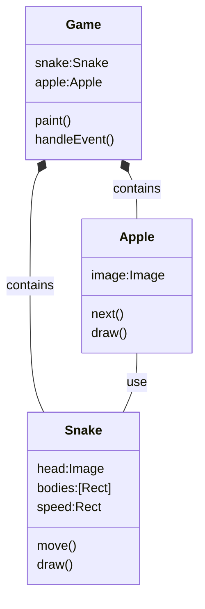

<h1>Snake Eat Apple Game</h1>

- [Start the Game](#start-the-game)
- [Getting start](#getting-start)
- [Objects in this game](#objects-in-this-game)
- [Display Apple and Snake](#display-apple-and-snake)
- [Move Snake](#move-snake)
- [Eat Apple](#eat-apple)
- [Make apple on grid](#make-apple-on-grid)
- [Add music](#add-music)
- [Add score](#add-score)
- [Snake eat apple vivid](#snake-eat-apple-vivid)
- [Add background image](#add-background-image)
- [Add Game Over](#add-game-over)

## Start the Game
* [Final version of this game](../src/snakeEatApple.py)
  
## Getting start
> use our existing game.py to initial lize this game
* [start up python file](../src/snakeEatApple01.py)

## Objects in this game



## Display Apple and Snake
* [create Apple and Snake class](../src/snakeEatApple02.py)

## Move Snake


* [create bodies in Snake class as rect list](../src/snakeEatApple03.py)
* [move snake with head and bodies](../src/snakeEatApple04.py)
* [once the snake move out, game over](../src/snakeEatApple05.py)
* [control snake by arrow keys](../src/snakeEatApple06.py)

## Eat Apple
* [Snake can eat apple](../src/snakeEatApple07.py)
* [crash on hit its own body](../src/snakeEatApple08.py)

## Make apple on grid
make change on randomPoint() function defined in appsuper.py, make each (x,y) on grid.

```py
def randomPoint(size=40):
    rows = AppSuper.width/size-1
    cols = AppSuper.height/size-1
    x = randint(0, rows)*size
    y = randint(0, cols)*size
    return (x, y)
```

## Add music
* [background music, eat apple ding, crash](../src/snakeEatApple09.py)

## Add score
* [Draw text](../src/snakeEatApple10.py)

## Snake eat apple vivid
* [](../src/outBound.py)
* [the apple will get into snake mouse](../src/snakeEatApple11.py)

## Add background image
* [add grass background](../src/snakeEatApple12.py)

## Add Game Over
* []()
